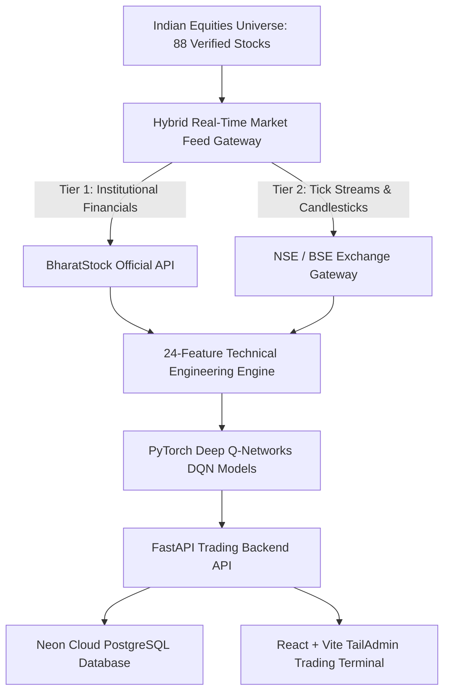

# 📈 NeuroTrade — Enterprise AI Trading & Risk Platform

[](https://www.python.org/)
[](https://pytorch.org/)
[](https://fastapi.tiangolo.com/)
[](https://reactjs.org/)
[](https://neon.tech/)
[](LICENSE)

**NeuroTrade** is an institutional-grade algorithmic trading and portfolio risk management platform engineered for Indian stock exchanges (NSE & BSE). The system integrates **Deep Reinforcement Learning (Double DQN)** across 88 custom-trained neural network models, connects to **BharatStock Official API** and real-time **Exchange Gateways** for live price streaming, and persists all portfolio holdings, trade logs, and risk alarms to **Serverless Cloud PostgreSQL (Neon)**.

---

## 🏛️ Platform Architecture



---

## 🌟 Core Capabilities

* **🧠 88 Custom PyTorch Deep Q-Networks (`models/*.pth`)**:
  - Dedicated neural models trained on 5+ years of historical daily candlestick data.
  - Generates neural `BUY` / `HOLD` / `SELL` decisions with confidence ratings and Q-value policy evaluation.
* **📡 Hybrid Market Data Stream**:
  - Direct integration with **BharatStock API** (`X-API-Key`) for 52-week highs/lows, PE ratios, and institutional metrics.
  - Multi-year candlestick technical charting studio (1W, 1M, 6M, 1Y, 2Y, 3Y, 5Y).
* **☁️ Serverless Cloud PostgreSQL Database (Neon.tech)**:
  - Real-time cloud persistence for user authentication (JWT), portfolio holdings, trade logs, and stop-loss breach alarms.
* **🛡️ Real-Time Risk & Stop-Loss Engine**:
  - Automatic trailing stop-loss, profit target breach monitoring, and interactive execution alerts.
* **🚫 Strict Real-Stock Validation**:
  - Eradicated synthetic/dummy stock generation. Unlisted or fake tickers are strictly rejected with HTTP 400/404 validation alerts.
* **🎨 TailAdmin Modern Dashboard**:
  - Collapsible stationary sidebar, global search, light/dark theme toggle, interactive notifications dropdown, and live portfolio distribution analytics.

---

## 📂 System Structure

```
NeuroTrade/
├── api/                        # FastAPI Backend Application
│   ├── database.py             # Cloud PostgreSQL Connection & Migrations
│   ├── main.py                 # API Root & Router Mounting
│   ├── models/
│   │   ├── db_models.py        # SQLAlchemy Cloud Database Schemas
│   │   └── schemas.py          # Pydantic Request & Response Models
│   ├── routes/
│   │   ├── auth.py             # User Signup, Login & JWT Tokens
│   │   ├── holdings.py         # Portfolio Management & AI Guidance
│   │   ├── predict.py          # Deep Q-Network Inference
│   │   ├── stocks.py           # Candlestick Data & Stock Search
│   │   └── trades.py           # Order Execution & Trade Ledger
│   └── services/
│       ├── ai_reasoning.py     # Algorithmic & Neural Portfolio Guidance
│       ├── auth.py             # Password Hashing (bcrypt) & JWT Handler
│       ├── live_data.py        # BharatStock & Exchange Feeds
│       ├── predictor.py        # Dynamic DQN Checkpoint Loader
│       └── stock_universe.py   # Verified 93 Indian Equities Directory
│
├── data/                       # Market Datasets & Features
│   ├── raw/                    # 5-Year Historical OHLCV Datasets
│   └── features/               # 24-Dimensional Technical Indicator Matrices
│
├── frontend/                   # React 18 + Vite Trading Terminal
│   ├── src/
│   │   ├── components/         # Modular Dashboard UI Components
│   │   │   ├── Sidebar.jsx
│   │   │   ├── TopNavbar.jsx
│   │   │   ├── TopStockCards.jsx
│   │   │   ├── StockHistoryChart.jsx
│   │   │   ├── SignalPanel.jsx
│   │   │   ├── RiskAlarms.jsx
│   │   │   ├── UserHoldingsTable.jsx
│   │   │   ├── TradeHistory.jsx
│   │   │   └── NotificationDropdown.jsx
│   │   ├── services/api.js     # Axios API Client
│   │   ├── App.jsx             # Master Dashboard Layout
│   │   └── index.css           # TailAdmin Design System & Theme Engine
│   └── package.json
│
├── models/                     # 88 Custom PyTorch Checkpoints (*_dqn_best.pth)
├── dqn_agent.py                # Deep Q-Network Agent Architecture
├── trading_environment.py      # Gymnasium Trading Environment (24 States)
├── feature_engineering.py      # Technical Indicator Calculations (RSI, MACD, etc.)
├── train_universe.py           # Automated Multi-Stock Batch Trainer
├── requirements.txt            # Python Dependencies
├── .env.example                # Safe Template for Environment Variables
└── .gitignore                  # Security Rules for Secrets & Artifacts
```

---

## 🛡️ Security & Secret Protection

* **Secret Isolation**: Real API keys, JWT secrets, and database connection strings are confined to `.env` and strictly excluded by `.gitignore`.
* **Database Encryption**: All database passwords and connections are transmitted over SSL/TLS (`sslmode=require`).
* **Authentication**: User passwords are encrypted using `bcrypt` with cryptographic salts and verified using standard JWT claims.

---

## 📄 License
This project is licensed under the MIT License — see the [LICENSE](LICENSE) file for details.
